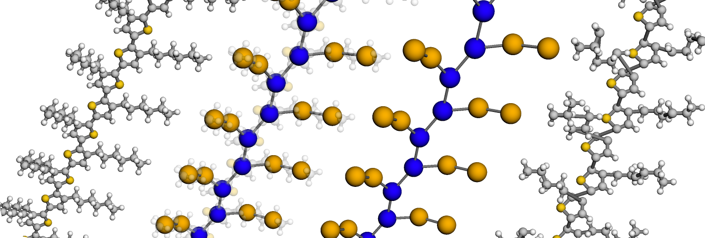

Introduction
============

GRiTS is a toolkit for working with coarse-grain systems.
It uses `mBuild`_ to build up molecules and `SMILES`_ chemical grammar to facilitate the mapping from fine-to-coarse and coarse-to-fine.

The GRiTS uses `openbabel`_ and `RDKit`_ for working with SMILES. Openbabel is used in the coarse-graining step to find instances of SMILES patterns within a molecule and RDKit is used in the fine-graining step to build up the SMILES moeities into a complete structure.

.. _mBuild: https://github.com/mosdef-hub/mbuild
.. _SMILES: https://www.daylight.com/dayhtml/doc/theory/theory.smiles.html
.. _openbabel: https://openbabel.org/docs/dev/UseTheLibrary/Python_Pybel.html
.. _RDKit: https://www.rdkit.org
