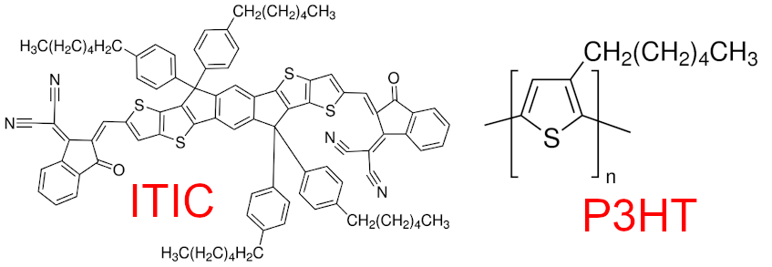

Using GRiTS on simulation data
==============================

In the following example we will demonstrate using GRiTS on data from a
real simulation. It is advisable to go through the “Intro to GRiTS”
tutorial first.

.. code:: ipython3

    import numpy as np
    import mbuild as mb

    from grits import CG_System
    from grits.utils import amber_dict

Coarse-graining
~~~~~~~~~~~~~~~

The following example will use a
`GSD <https://gsd.readthedocs.io/en/stable/index.html>`__ file from a
`HOOMD <https://hoomd-blue.readthedocs.io/en/latest/>`__ simulation
initialized and run using
`PlanckTon <https://github.com/cmelab/planckton>`__.

The simulation was run using the general amber forcefield and the
chemistries are shown below:

   structures

In order to apply a coarse-grain mapping to an atomistic structure we
need to know the atom indices which correspond to each bead. GRiTS works
by using
`SMILES <https://www.daylight.com/dayhtml/doc/theory/theory.smiles.html>`__
strings to find instances of that chemical fragment and map those atom
indices to a bead. The goal of this example is to map the backbone of
each ITIC molecule and the thiophene ring in each P3HT monomer (the GSD
file contains a 16-mer) to a bead.

The next cell visualizes the target fragments:

.. code:: ipython3

    itic_backbone = "c1c4c(cc2c1Cc3c2scc3)Cc5c4scc5"
    thiophene = "c1cscc1"
    a = mb.load(itic_backbone, smiles=True)
    a.visualize().show()

    b = mb.load(thiophene, smiles=True)
    b.visualize().show()

Next we will pass these SMILES patterns, along with our gsdfile and type
dictionary, to the ``CG_System`` class to create our coarse-grained
structure. The SMILES patterns for these beads are chosen carefully such
that they are exclusive: The thiophene moiety used to map P3HT also
exists in ITIC, but because the ``itic_backbone`` pattern we have chosen
uses up the atoms in the thiophenes and this pattern is first in the
``beads`` dictionary, only the ``itic_backbone`` pattern will match in
ITIC.

The SMILES matching used in the ``CG_Compound`` class is slow, so the
``CG_System`` class relies on a couple assumptions:

1. Molecules
   (`freud.cluster.Cluster <https://freud.readthedocs.io/en/latest/modules/cluster.html>`__\ s
   determined using bonds) having the same number of particles are
   assumed to have the same structure. (e.g., if two molecules each have
   402 particles, they are assumed to have the same structure.)
2. Atom order within each structure is assumed to be constant. (e.g., if
   the order of atoms in water is HOH, then all water structures are in
   that order–not OHH or HHO.)
3. The particle indices are assumed to be constant for each frame of the
   trajectory.

.. code:: ipython3

    gsdfile = "../grits/tests/assets/itic-p3ht.gsd"
    system = CG_System(
        gsdfile,
        beads={"_A": itic_backbone, "_B" : thiophene},
        conversion_dict=amber_dict
    )

The cell above will have a couple warnings which can be safely ignored:
one from OpenBabel, another telling us that some atoms were left out of
coarse-graining (expected since we do not map the entire structure of
ITIC or P3HT), and another telling us that the ``itic_backbone`` string
wasn’t found (we do not expect this pattern to exist in P3HT).

Next we can save the mapped structure to a GSD file; by default every
frame will mapped and saved:

.. code:: ipython3

    cg_gsd = "itic-p3ht-cg.gsd"
    system.save(cg_gsd)

To see the coarse-grain mapping we can open both files in
`OVITO <https://www.ovito.org/>`__ or
`VMD <https://www.ks.uiuc.edu/Research/vmd/>`__ with `the gsd-vmd
plugin <https://github.com/mphowardlab/gsd-vmd>`__.

The images below showing the bead overlaid with the atomistic structure
were created using OVITO:

|itic| |p3ht|

If we have multiple statepoints with the same initial structure and want
to reuse our mapping, we can save the mapping to a json file:

.. |itic| image:: cg-itic.png
.. |p3ht| image:: cg-p3ht.png

.. code:: ipython3

    cg_json = "itic-p3ht-cg.json"
    system.save_mapping(cg_json)
